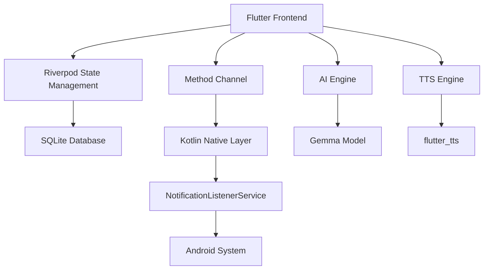
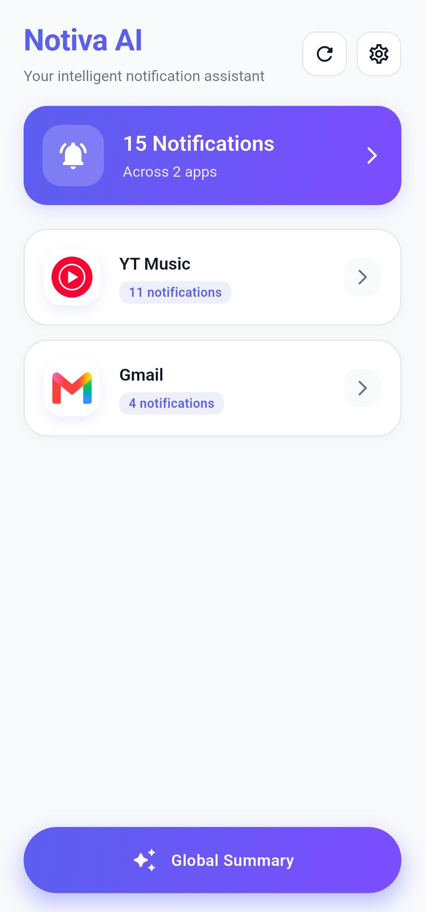
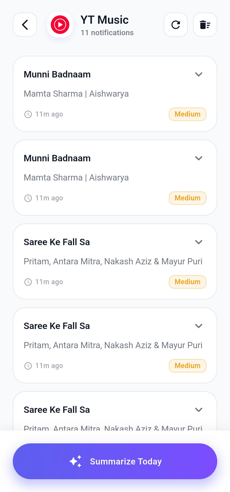
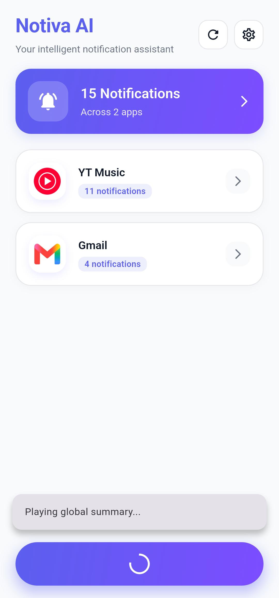
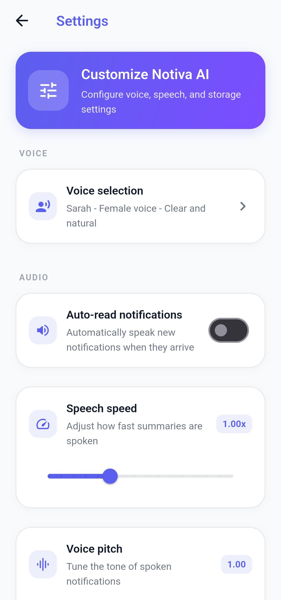

<div align="center">

# 🔔 Notiva AI - AI Notification Assistant

### Privacy-First Notification Manager with AI Summarization & Text-to-Speech

[](https://flutter.dev)
[](https://kotlinlang.org)
[](https://www.android.com)
[](LICENSE)

**🔒 100% Offline** • **🛡️ Privacy-First** • **🤖 AI-Powered** • **🎯 Production-Ready**

[Features](#-features) • [Architecture](#-architecture) • [Installation](#-installation) • [Build Guide](#-build--deployment) • [Screenshots](#-screenshots) • [Contributing](#-contributing)

</div>

---

## 📖 Overview

Notiva AI is a **privacy-first Android notification manager** that captures system notifications, stores them locally, organizes them by app, generates AI-powered summaries using the **Gemma model**, and reads notifications aloud using **Text-to-Speech**—all **completely offline**.

### 🎯 Key Highlights

- **🔒 100% Offline** - No cloud APIs, all processing happens on-device
- **🛡️ Privacy-First** - Sensitive data (OTP, cards, emails) automatically masked
- **🤖 AI-Powered** - Local Gemma model for intelligent summarization
- **📱 App-Based Organization** - Notifications grouped by actual apps, not generic categories
- **🎙️ Text-to-Speech** - Read notifications aloud with customizable voice settings
- **⚡ Background Operation** - Captures notifications even when app is closed
- **🎨 Material Design 3** - Modern, beautiful UI with dark mode support

---

## ✨ Features

### 🔔 Smart Notification Capture
- **Real-time capture** of all system notifications
- **Background operation** - Works even when app is closed
- **Direct database save** - Notifications persist automatically
- **App icon extraction** - Visual identification of notification sources

### 🗂️ Intelligent Organization
- **App-based grouping** - Notifications organized by source application
- **Notification counting** - See unread count per app
- **Priority detection** - Automatic classification (High/Medium/Low)
- **Read/unread status** - Track which notifications you've reviewed

### 🎯 Priority Detection System

<table>
<tr>
<td width="33%">

#### 🔴 High Priority
- OTP & verification codes
- Banking transactions
- Missed calls
- Meeting reminders

</td>
<td width="33%">

#### 🟡 Medium Priority
- Personal messages
- Regular notifications
- Default category

</td>
<td width="33%">

#### 🟢 Low Priority
- Social media reactions
- Promotional offers
- Marketing messages

</td>
</tr>
</table>

### 🛡️ Privacy Protection Layer

```
Before AI Processing:
"Your OTP is 123456" → "Your OTP is [OTP]"
"Card ending 4532" → "Card ending [CARD INFO]"
"Email: user@email.com" → "Email: [EMAIL]"
```

**Privacy Filters:**
- ✅ OTP code masking (`\b\d{4,6}\b`)
- ✅ Card number masking (`\b(?:\d[ -]*?){13,16}\b`)
- ✅ Email address masking
- ✅ All processing on-device
- ✅ Zero cloud transmission

### 🤖 AI Summarization Engine

**Powered by Local Gemma Model**

| Summary Type | Description | Use Case |
|-------------|-------------|----------|
| **App Summary** | Summarize notifications from specific app | "Summarize all WhatsApp messages" |
| **Global Summary** | All unread notifications | "What did I miss?" |
| **Important Summary** | High-priority notifications only | "Any urgent messages?" |
| **Daily Digest** | Today's notifications | "What happened today?" |
| **Weekly Digest** | Last 7 days | "Weekly overview" |

### 🎙️ Text-to-Speech System

**Features:**
- 🎚️ Configurable speech rate (0.5x - 2.0x)
- 🎵 Adjustable pitch (0.5 - 2.0)
- 🔊 Volume control
- 🌍 Multi-language support
- 🎧 Bluetooth audio support

**Reading Modes:**
- 📢 Read latest notification
- 📱 Read all from specific app
- 📋 Read all notifications
- ⚡ Read important only
- 📝 Read AI summaries

### 📊 Local Database Architecture

```sql
apps
├── id (INTEGER PRIMARY KEY)
├── app_name (TEXT)
├── package_name (TEXT UNIQUE)
├── icon_path (TEXT)
└── notification_count (INTEGER DEFAULT 0)

notifications
├── id (INTEGER PRIMARY KEY)
├── app_id (INTEGER FOREIGN KEY)
├── sender (TEXT)
├── title (TEXT)
├── message (TEXT)
├── timestamp (INTEGER)
├── read_status (INTEGER DEFAULT 0)
└── priority (INTEGER DEFAULT 1)

summaries
├── id (INTEGER PRIMARY KEY)
├── app_id (INTEGER FOREIGN KEY)
├── summary_text (TEXT)
└── created_at (INTEGER)

settings
├── id (INTEGER PRIMARY KEY)
├── voice (TEXT)
├── speech_rate (REAL)
├── pitch (REAL)
├── auto_read (INTEGER DEFAULT 0)
└── retention_days (INTEGER DEFAULT 7)
```

---

## 🏗️ Architecture

### Technology Stack



### Core Technologies

| Component | Technology | Purpose |
|-----------|-----------|---------|
| **Framework** | Flutter 3.0+ | Cross-platform UI |
| **State Management** | Riverpod 2.4+ | Reactive state handling |
| **Database** | SQLite (sqflite) | Local data persistence |
| **AI Model** | Gemma (Local) | Offline summarization |
| **TTS** | flutter_tts | Text-to-speech |
| **Native** | Kotlin | Android integration |

### Data Flow

```
📱 Android System Notification
         ↓
🔍 NotificationListenerService (Kotlin)
         ↓ [MethodChannel + Direct DB Save]
🔄 NotificationReceiver (Flutter)
         ↓
🛡️ Privacy Filter (Mask Sensitive Data)
         ↓
🎯 Priority Processor (Classify Urgency)
         ↓
💾 SQLite Database
         ↓
⚡ Riverpod Providers (State Management)
         ↓
🎨 UI (Dashboard/Detail/Summary Screens)
```

### Project Structure

```
lib/
├── core/
│   ├── constants/              # App-wide constants
│   │   ├── app_constants.dart
│   │   └── tts_config.dart
│   ├── providers/              # Global providers
│   │   └── connectivity_provider.dart
│   ├── services/               # Core services
│   │   └── retention_policy_service.dart
│   ├── observers/              # Lifecycle observers
│   │   └── audio_lifecycle_observer.dart
│   └── theme/                  # App theming
│       ├── app_colors.dart
│       ├── app_spacing.dart
│       ├── app_theme.dart
│       └── app_typography.dart
│
├── features/
│   ├── notifications/
│   │   ├── models/             # Data models
│   │   │   ├── app_model.dart
│   │   │   └── notification_model.dart
│   │   ├── repository/         # Database operations
│   │   │   ├── notification_repository.dart
│   │   │   └── notification_provider.dart
│   │   ├── listener/           # Native bridge
│   │   │   └── notification_receiver.dart
│   │   ├── screens/            # UI screens
│   │   │   ├── dashboard_screen_modern.dart
│   │   │   ├── app_detail_screen_modern.dart
│   │   │   └── permission_screen.dart
│   │   └── widgets/            # Reusable widgets
│   │       └── app_icon_widget.dart
│   │
│   ├── ai/
│   │   ├── gemma/              # Local AI model
│   │   │   ├── gemma_service.dart
│   │   │   └── model_manager_service.dart
│   │   ├── processors/         # Privacy & priority
│   │   │   ├── privacy_processor.dart
│   │   │   └── priority_processor.dart
│   │   ├── prompts/            # AI prompt templates
│   │   │   └── summary_prompts.dart
│   │   └── summarizer/         # Summarization logic
│   │       └── notification_summarizer.dart
│   │
│   ├── audio/
│   │   └── tts/                # Text-to-speech
│   │       ├── tts_service.dart
│   │       ├── tts_provider.dart
│   │       └── voice_service.dart
│   │
│   └── settings/               # App settings
│       ├── screens/
│       │   └── settings_screen.dart
│       └── providers/
│           └── settings_provider.dart
│
├── shared/
│   └── database/               # SQLite helper
│       └── database_helper.dart
│
└── main.dart                   # App entry point
```

### Android Native Integration

```
android/app/src/main/kotlin/com/notivaai/notifications/
├── MainActivity.kt                         # Main Flutter activity
└── services/
    ├── NotificationListener.kt            # Notification capture service
    ├── NotificationDatabaseHelper.kt      # Native DB operations
    ├── AppIconExtractor.kt                # App icon management
    └── BootReceiver.kt                    # Auto-start on boot
```

**Key Native Features:**
- 🔔 NotificationListenerService - Captures all system notifications
- 💾 Direct database writes - Works in background
- 📞 MethodChannel bridge - Flutter communication
- 🔄 Boot receiver - Auto-start service
- 🎨 Icon extraction - Visual app identification

---

## 🚀 Installation

### Prerequisites

| Requirement | Version | Purpose |
|------------|---------|---------|
| **Flutter SDK** | 3.0.0+ | Framework |
| **Dart SDK** | 2.19.0+ | Programming language |
| **Android Studio** | 2022.1+ | IDE & Android SDK |
| **JDK** | 8 or 11 | Java compilation |
| **Android Device** | API 24+ (7.0) | Testing & deployment |

### Quick Start

```bash
# 1. Clone the repository
git clone https://github.com/yourusername/notiva-ai.git
cd notiva-ai

# 2. Install dependencies
flutter pub get

# 3. Check Flutter setup
flutter doctor

# 4. Run on connected device
flutter run

# 5. Build release APK
flutter build apk --release
```

---

## 🔧 Build & Deployment

### Development Build

```bash
# Clean previous builds
flutter clean

# Get dependencies
flutter pub get

# Run in debug mode
flutter run

# Run in release mode
flutter run --release
```

### Production Build

```bash
# Build release APK
flutter build apk --release

# Output location:
# build/app/outputs/flutter-apk/app-release.apk

# Install to connected device
flutter install
```

### Build Configuration

**File:** `android/app/build.gradle.kts`

```kotlin
android {
    namespace = "com.notivaai.notifications"
    compileSdk = flutter.compileSdkVersion
    
    defaultConfig {
        applicationId = "com.notivaai.notifications"
        minSdk = 24                    // Android 7.0+
        targetSdk = flutter.targetSdkVersion
        versionCode = 1
        versionName = "1.0.0"
    }
    
    compileOptions {
        sourceCompatibility = JavaVersion.VERSION_1_8
        targetCompatibility = JavaVersion.VERSION_1_8
    }
}
```

### Known Build Issues & Solutions

<details>
<summary><b>Issue 1: Unresolved Java References</b></summary>

**Error:**
```
Unresolved reference: util
Unresolved reference: io
```

**Solution:**
Add imports in `build.gradle.kts`:
```kotlin
import java.util.Properties
import java.io.FileInputStream
```
</details>

<details>
<summary><b>Issue 2: Java Version Mismatch</b></summary>

**Error:**
```
Cannot find a Java installation matching: {languageVersion=17}
```

**Solution:**
Use Java 8 in `build.gradle.kts`:
```kotlin
compileOptions {
    sourceCompatibility = JavaVersion.VERSION_1_8
    targetCompatibility = JavaVersion.VERSION_1_8
}
```
</details>

<details>
<summary><b>Issue 3: MainActivity ClassNotFoundException</b></summary>

**Error:**
```
ClassNotFoundException: com.notivaai.notifications.MainActivity
```

**Solution:**
Ensure Kotlin files are in correct package structure:
```
android/app/src/main/kotlin/com/notivaai/notifications/
```
</details>

---

## 📱 Usage Guide

### First-Time Setup

1. **Install the app** on your Android device
2. **Grant notification access** when prompted
3. **Allow permissions**:
   - Notification access
   - Post notifications
   - Boot completed

### Granting Notification Access

```
Settings → Apps → Special app access → Notification access → Notiva AI → Enable
```

### Basic Operations

#### Viewing Notifications
1. Open the app
2. See all apps with notification counts
3. Tap an app to view its notifications
4. Swipe to mark as read or delete

#### AI Summarization
1. Tap **Summarize** button on any app
2. Choose summary type:
   - App-specific summary
   - All notifications
   - Important only
3. View AI-generated summary
4. Tap play button for TTS

#### Text-to-Speech
1. Go to Settings
2. Adjust speech rate (0.5x - 2.0x)
3. Adjust pitch (0.5 - 2.0)
4. Select voice
5. Tap **Read** on any notification

---

## 🎨 Screenshots

<div align="center">

### Dashboard


### Notification Details


### AI Summary


### Settings


</div>

---

## 🔐 Privacy & Security

### Privacy Commitments

✅ **100% Offline Processing** - No data leaves your device  
✅ **No Cloud Servers** - Zero external API calls  
✅ **No Analytics** - No tracking or telemetry  
✅ **No Third-Party SDKs** - Only essential Flutter plugins  
✅ **Automatic Data Masking** - Sensitive info protected  
✅ **Local Storage Only** - SQLite on device  

### Data We NEVER Collect

❌ Personal information  
❌ Notification content  
❌ Contact lists  
❌ Location data  
❌ Usage statistics  
❌ Device identifiers  

### Permissions Explained

| Permission | Purpose | Required |
|------------|---------|----------|
| `BIND_NOTIFICATION_LISTENER_SERVICE` | Capture system notifications | ✅ Yes |
| `POST_NOTIFICATIONS` | Show app notifications | ✅ Yes |
| `RECEIVE_BOOT_COMPLETED` | Auto-start service | ⚠️ Optional |
| `INTERNET` | Future model downloads | ⚠️ Optional |
| `WAKE_LOCK` | Keep service running | ⚠️ Optional |

---

## 🛠️ Development

### Dependencies

```yaml
dependencies:
  flutter_riverpod: ^2.4.9          # State management
  sqflite: ^2.3.0                   # Local database
  flutter_tts: ^3.8.3               # Text-to-speech
  path_provider: ^2.1.2             # File system access
  permission_handler: ^11.1.0       # Permission management
  intl: ^0.18.1                     # Internationalization
  shared_preferences: ^2.2.2        # Simple key-value storage
  workmanager: ^0.9.0+3             # Background tasks
  google_generative_ai: ^0.2.2      # AI model integration
  connectivity_plus: ^5.0.0         # Network status
```

### Setting Up Development Environment

```bash
# 1. Install Flutter
# Visit https://flutter.dev/docs/get-started/install

# 2. Clone repository
git clone https://github.com/yourusername/notiva-ai.git
cd notiva-ai

# 3. Install dependencies
flutter pub get

# 4. Run code generation (if needed)
flutter pub run build_runner build --delete-conflicting-outputs

# 5. Check for issues
flutter analyze

# 6. Run tests
flutter test

# 7. Run on device
flutter run
```

### Code Style

- **Linting:** `flutter_lints: ^6.0.0`
- **Formatting:** `dart format .`
- **Analysis:** `flutter analyze`

### Testing

```bash
# Run all tests
flutter test

# Run with coverage
flutter test --coverage

# Run specific test
flutter test test/features/notifications/repository_test.dart
```

---

## 🗺️ Roadmap

### ✅ Completed

- [x] Notification capture system
- [x] Local SQLite database
- [x] Privacy protection layer
- [x] Priority detection
- [x] TTS integration
- [x] Material Design 3 UI
- [x] Dark mode support
- [x] Background operation
- [x] App icon extraction
- [x] Notification grouping

### 🚧 In Progress

- [ ] Gemma model integration (MediaPipe)
- [ ] Model download UI
- [ ] Settings persistence
- [ ] Bluetooth audio detection

### 📋 Planned Features

- [ ] Notification templates
- [ ] Custom notification filters
- [ ] Export notification data
- [ ] Backup/restore functionality
- [ ] Widget support
- [ ] Quick reply from summary
- [ ] Multi-language UI
- [ ] Voice commands
- [ ] Smart notification bundling
- [ ] Scheduled summaries

---

## 🤝 Contributing

We welcome contributions! Please follow these guidelines:

### How to Contribute

1. **Fork the repository**
2. **Create a feature branch**
   ```bash
   git checkout -b feature/amazing-feature
   ```
3. **Commit your changes**
   ```bash
   git commit -m 'Add amazing feature'
   ```
4. **Push to the branch**
   ```bash
   git push origin feature/amazing-feature
   ```
5. **Open a Pull Request**

### Contribution Guidelines

- Follow existing code style
- Add tests for new features
- Update documentation
- Keep commits atomic
- Write clear commit messages

### Code of Conduct

- Be respectful and inclusive
- Welcome newcomers
- Focus on constructive feedback
- Report issues professionally

---

## 📄 License

This project is licensed under the **MIT License** - see the [LICENSE](LICENSE) file for details.

```
MIT License

Copyright (c) 2024 Notiva AI

Permission is hereby granted, free of charge, to any person obtaining a copy
of this software and associated documentation files (the "Software"), to deal
in the Software without restriction, including without limitation the rights
to use, copy, modify, merge, publish, distribute, sublicense, and/or sell
copies of the Software, and to permit persons to whom the Software is
furnished to do so, subject to the following conditions:
```

---

## 📞 Support & Contact

### Get Help

- 📖 **Documentation:** [Wiki](https://github.com/yourusername/notiva-ai/wiki)
- 🐛 **Bug Reports:** [Issues](https://github.com/yourusername/notiva-ai/issues)
- 💡 **Feature Requests:** [Discussions](https://github.com/yourusername/notiva-ai/discussions)
- 💬 **Community:** [Discord](https://discord.gg/notiva-ai)

### Connect With Us

- 🌐 **Website:** [notiva.ai](https://notiva.ai)
- 🐦 **Twitter:** [@NotivaAI](https://twitter.com/NotivaAI)
- 📧 **Email:** support@notiva.ai

---

## 🙏 Acknowledgments

### Built With

- [Flutter](https://flutter.dev) - UI Framework
- [Riverpod](https://riverpod.dev) - State Management
- [SQLite](https://www.sqlite.org) - Database
- [Gemma](https://ai.google.dev/gemma) - AI Model
- [Material Design 3](https://m3.material.io) - Design System

### Special Thanks

- Flutter community for excellent packages
- Google for Gemma model
- All contributors and testers

---

## 📊 Project Stats


---

<div align="center">

### ⭐ Star this repository if you find it helpful!

**Made with ❤️ for Privacy-Conscious Users**

[⬆ Back to Top](#-notiva-ai---ai-notification-assistant)

</div>
